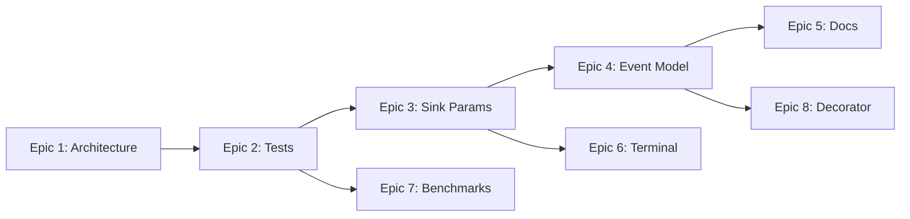

# StreamLL Simplification Roadmap

## Overview
Transform StreamLL from an over-engineered 0.1.0 project into an elegant, production-ready observability tool that AI developers will love. Each epic is independent, measurable, and delivers immediate value.

---

## Phase 1: Foundation Cleanup (Weeks 1-2)

### Epic 1: Architectural Consistency Fix
**Outcome**: All sinks use identical parameter names and patterns. No more TODOs describing problems.

**Success Metrics**:
- Zero architecture TODOs in codebase
- All sinks accept same base parameters
- Consistent error handling across all sinks

**Tasks**:
1. Rename Redis `max_batch_size` → `batch_size` to match base class
2. Implement `batch_size` and `flush_interval` in RabbitMQ sink
3. Standardize buffer overflow strategy (pick one: drop_oldest)
4. Unify time source to `time.time()` everywhere
5. Remove all "ARCHITECTURE CONSISTENCY" TODO comments

**Non-breaking changes only** - existing code continues to work

---

### Epic 2: Test Reality Check
**Outcome**: 20 working tests that actually run and verify core functionality. Delete all unused test infrastructure.

**Success Metrics**:
- 20 passing tests in CI
- Test-to-implementation ratio > 0.5:1
- Zero test fixtures without corresponding tests

**Tasks**:
1. Write 5 tests for Redis sink (connect, send, buffer, flush, reconnect)
2. Write 5 tests for RabbitMQ sink (same pattern)
3. Write 5 tests for Terminal sink (format, output, filtering)
4. Write 5 tests for decorator (instrument, event emission, filtering)
5. Delete unused fixtures: `InfrastructureTester`, `ConnectionResilienceTester`, `TestResourceTracker`
6. Simplify conftest.py to <50 lines

**File deletions**:
- `tests/fixtures/infrastructure.py` (131 lines)
- `tests/fixtures/kafka.py` (if no Kafka sink exists)
- Complex fixture factories

---

## Phase 2: API Simplification (Weeks 3-4)

### Epic 3: Sink Parameter Diet
**Outcome**: Sinks work with 3 parameters or less for 90% of use cases. Advanced config available but hidden.

**Success Metrics**:
- Default instantiation works: `RedisSink()`
- 90% of examples use ≤3 parameters
- Advanced config via separate `.configure()` method

**Implementation**:
```python
# Before: 16 parameters
sink = RedisSink(url=..., stream_key=..., buffer_size=..., 
                 max_batch_size=..., flush_interval=..., ...)

# After: Simple defaults
sink = RedisSink()  # Works immediately
sink = RedisSink(url="redis://prod")  # Most common case
sink = RedisSink().configure(buffer_size=50000)  # Advanced only when needed
```

**Tasks**:
1. Create sensible defaults for all parameters
2. Move advanced parameters to `configure()` method
3. Update all sinks: Redis (16→3), RabbitMQ (12→3), Terminal (6→0)
4. Deprecate (not remove) old constructor parameters
5. Update examples to use simple form

---

### Epic 4: Event Model Minimalism
**Outcome**: StreamllEvent contains only essential fields. Version tracking removed.

**Success Metrics**:
- Event model has 5 fields (down from 12)
- Serialized event size reduced by 40%
- No version tracking code remains

**Tasks**:
1. Remove `module_version` field
2. Remove `code_signature` field
3. Simplify metadata to flat dict
4. Remove AST hashing code
5. Update all event creation to use simplified model
6. Migration: Make removed fields optional first, then delete

**Final Model**:
```python
class StreamllEvent:
    event_id: str
    execution_id: str
    timestamp: datetime
    event_type: str  # start|end|error|token
    data: dict[str, Any]
```

---

## Phase 3: Documentation Reality (Week 5)

### Epic 5: Documentation Consolidation
**Outcome**: One README, one API reference. 2,000 lines total (down from 7,854).

**Success Metrics**:
- Documentation ≤2,000 lines total
- No duplicate content
- All examples actually run

**Tasks**:
1. Merge all installation guides into README
2. Create single `API.md` with all public methods
3. Delete production guides (not production-tested)
4. Delete comparison guides (premature)
5. Keep only working examples
6. Archive (don't delete) removed docs in `docs/archive/`

**Files to consolidate**:
- `quickstart.md` → README
- `installation.md` → README
- `production/*.md` → Archive
- `examples/*.md` → Keep 3 best

---

## Phase 4: Terminal Sink Clarity (Week 6)

### Epic 6: Terminal Sink Simplification
**Outcome**: Terminal sink is 50 lines of clear, simple code that just prints JSON.

**Success Metrics**:
- Terminal sink < 50 lines
- No async complexity
- No rich formatting detection
- Just works

**Tasks**:
1. Remove async queue code (commented out anyway)
2. Remove rich formatting (make it a separate `RichTerminalSink` if needed)
3. Simplify to basic JSON printing
4. Remove all configuration parameters
5. One method: print event as formatted JSON

**Final Implementation**:
```python
class TerminalSink(BaseSink):
    def handle_event(self, event: StreamllEvent) -> None:
        print(json.dumps(event.model_dump(), indent=2, default=str))
```

---

## Phase 5: Performance Claims Validation (Week 7)

### Epic 7: Benchmark Reality
**Outcome**: All performance claims backed by reproducible benchmarks.

**Success Metrics**:
- Benchmark suite that runs in CI
- Remove or prove all performance claims
- Published benchmark results

**Tasks**:
1. Create `benchmarks/` directory
2. Write Redis pipeline benchmark (prove 82x claim or remove it)
3. Write RabbitMQ batching benchmark
4. Write event throughput benchmark
5. Remove unsubstantiated performance claims from docs
6. Add benchmark results to README

---

## Phase 6: Clean Decorator (Week 8)

### Epic 8: Decorator Elegance
**Outcome**: `@streamll.instrument` just works. No parameters needed for 90% of cases.

**Success Metrics**:
- Decorator works with zero parameters
- Examples are one line
- Advanced filtering via separate API

**Tasks**:
1. Make all decorator parameters optional with smart defaults
2. Auto-detect operations (don't require list)
3. Move sink configuration to `streamll.configure()`
4. Simplify event filtering
5. Update all examples to use simple form

**Before**:
```python
@streamll.instrument(operations=["predict"], include_inputs=True, 
                    include_outputs=True, event_filter={"start", "end"})
```

**After**:
```python
@streamll.instrument  # Just works
```

---

## Execution Order & Dependencies



## Success Metrics Summary

After completing all epics:
- **Lines of code**: 4,544 → ~3,000 (-34%)
- **Documentation**: 7,854 → 2,000 (-75%)
- **Test coverage**: 0% → 50%+
- **API parameters**: 50+ → 15 (-70%)
- **Time to first event**: 5 min → 30 seconds

## Risk Mitigation

1. **Backwards compatibility**: Use deprecation warnings, not breaks
2. **User migration**: Provide migration guide for each epic
3. **Rollback plan**: Git tags before each epic
4. **Testing**: Each epic must pass CI before next begins
5. **Documentation**: Update docs in same PR as code changes

## Definition of Done (per Epic)

- [ ] All tests pass
- [ ] Documentation updated
- [ ] Examples run successfully
- [ ] No new TODOs added
- [ ] Metrics measured and recorded
- [ ] PR reviewed and merged

---

## Quick Wins First

Start with Epic 1 (Architecture Consistency) and Epic 2 (Test Reality) as they:
1. Fix immediate pain points
2. Establish foundation for other changes
3. Show measurable improvement quickly
4. Build momentum for larger changes